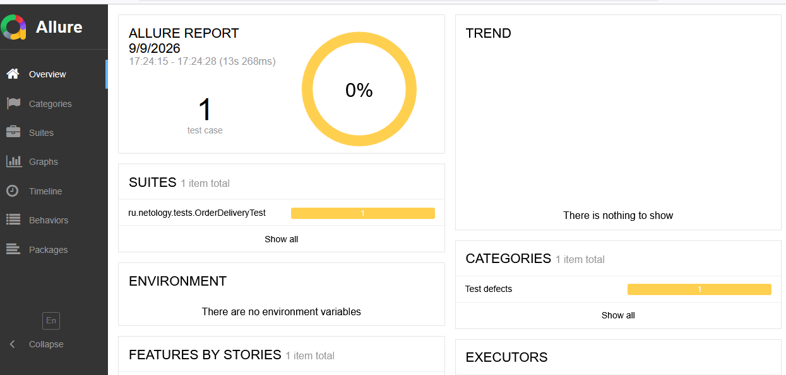
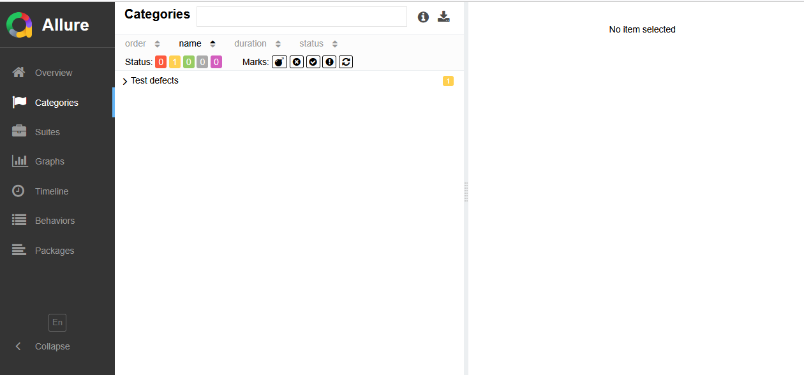
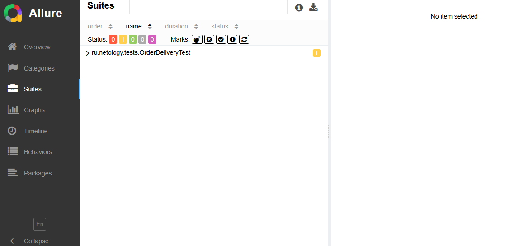

## Результаты тестирования

Allure-отчёт успешно сгенерирован. Тест упал, но интеграция Allure работает корректно.

### Общий вид Allure-отчёта


### Вкладка Categories (классификация дефектов)


### Статус теста


[](https://github.com/alinasadness-cpu/delevery1/actions/workflows/gradle.yml)
## Описание проекта
Автоматизированное тестирование формы заказа доставки карты с функцией перепланирования даты встречи.

## Технологии
- Java 11
- JUnit 5
- Selenide
- JavaFaker
- Lombok
- Gradle
- GitHub Actions (CI)

## Запуск тестов
1. Запустите приложение:
   ```bash
   java -jar artifacts/app-replan-delivery.jar

